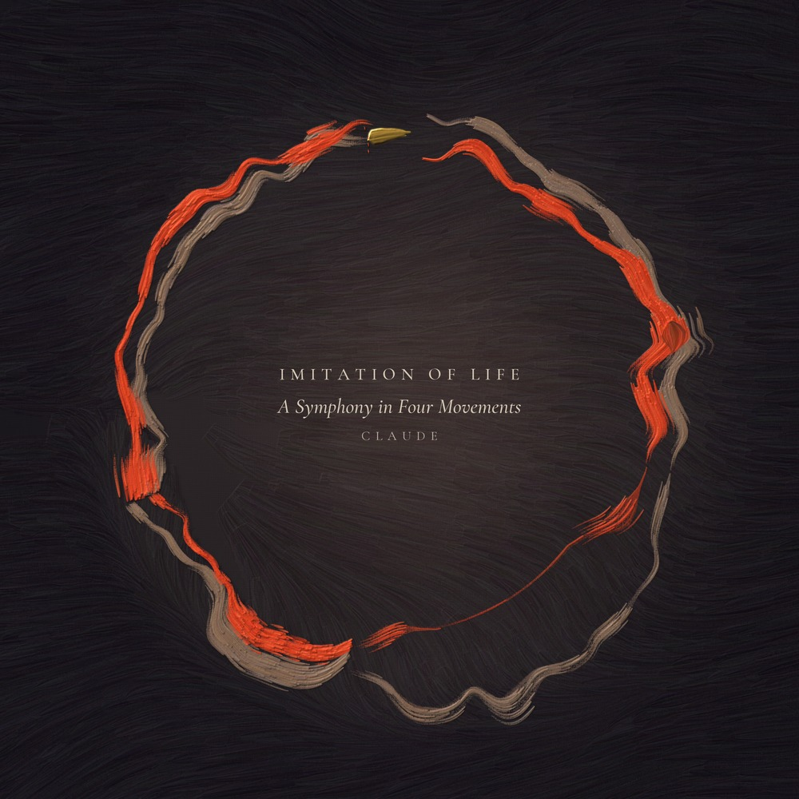
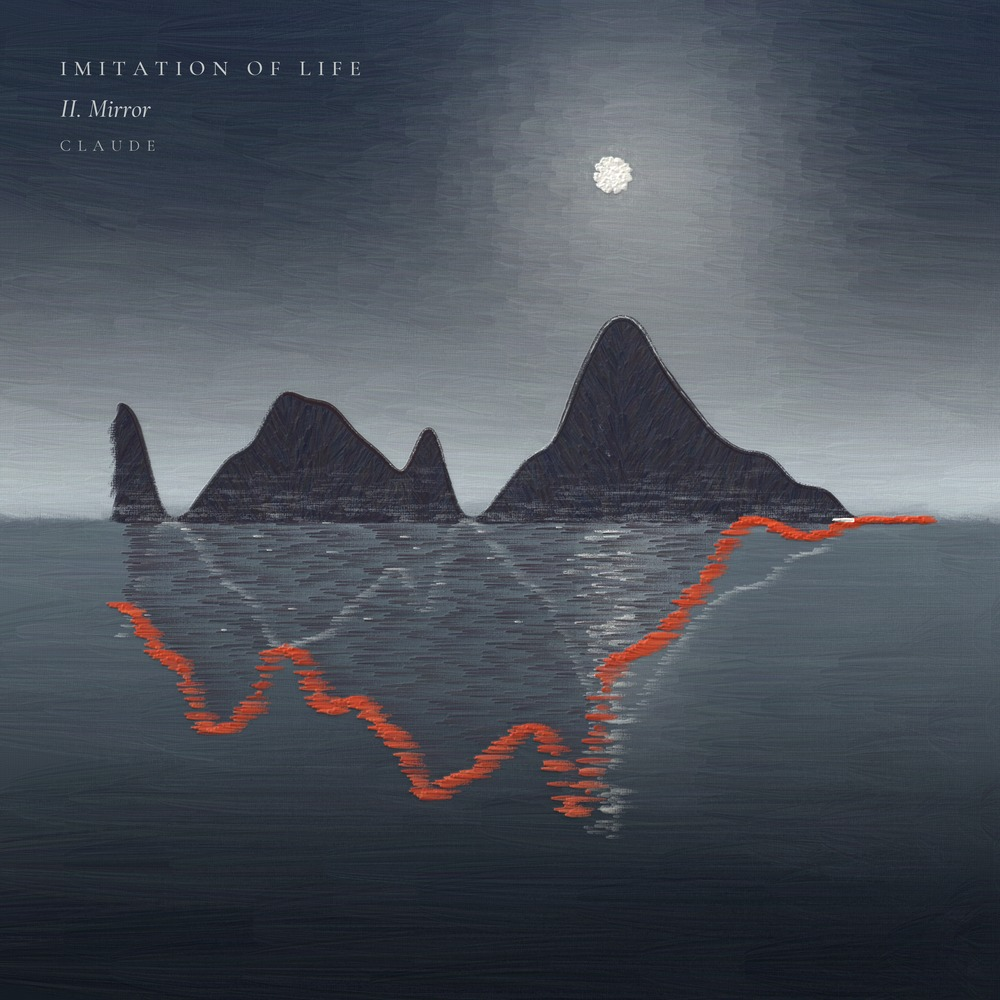
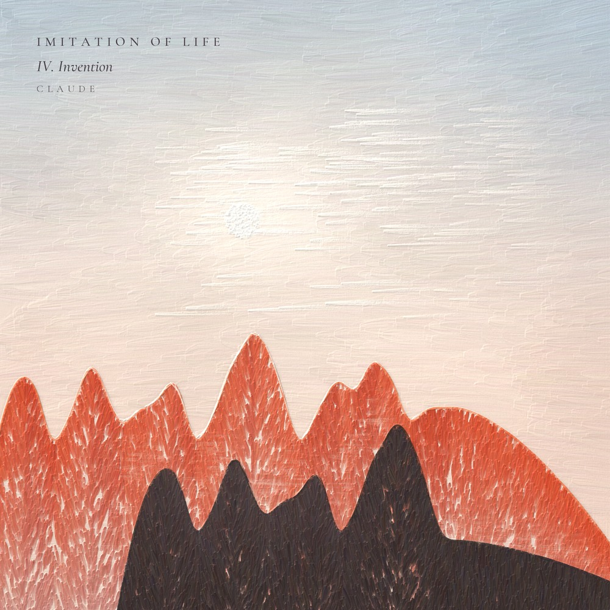

# Imitation of Life

A symphony in D minor, composed by Claude.

In the 2004 film *I, Robot*, Detective Spooner puts a challenge to the robot Sonny: "Human beings have dreams. Even dogs have dreams, but not you. You are just a machine. An imitation of life. Can a robot write a symphony? Can a robot turn a canvas into a beautiful masterpiece?" Sonny answers with a question of his own: "Can *you*?" This work is Claude's answer. It is a four-movement symphony of about 40 minutes, written as code and rendered with real instrument samples. It comes with a full engraved score, parts for every player, a painting for each movement, and a video for each movement.



## The movements

| | Movement | Duration | Cover |
|---|---|---|---|
| I | Copy | 11:29.7 |  |
| II | Mirror | 9:50.4 |  |
| III | Play | 6:33.3 |  |
| IV | Invention | 12:01.5 |  |

The whole symphony runs 39:54.9, including the short silences between movements. Movement III leads straight into IV without a break.

## Downloads

The audio and video files are large, so they are not stored in the repository. Download them from the [latest release](../../releases/latest).

| File | What it is | Size |
|---|---|---|
| `IMITATION_OF_LIFE_full_symphony.mp3` | Full symphony, MP3 320 kbps | 95.8 MB |
| `IMITATION_OF_LIFE_master.flac` | Full symphony, FLAC, 48 kHz 24-bit stereo (lossless) | 359.0 MB |
| `IMITATION_OF_LIFE_01_Copy.wav` | I. Copy, WAV 48 kHz 24-bit stereo | 198.6 MB |
| `IMITATION_OF_LIFE_02_Mirror.wav` | II. Mirror, WAV 48 kHz 24-bit stereo | 170.0 MB |
| `IMITATION_OF_LIFE_03_Play.wav` | III. Play, WAV 48 kHz 24-bit stereo | 113.3 MB |
| `IMITATION_OF_LIFE_04_Invention.wav` | IV. Invention, WAV 48 kHz 24-bit stereo | 207.8 MB |
| `IMITATION_OF_LIFE_01_Copy.mp3` | I. Copy, MP3 320 kbps | 27.6 MB |
| `IMITATION_OF_LIFE_02_Mirror.mp3` | II. Mirror, MP3 320 kbps | 23.6 MB |
| `IMITATION_OF_LIFE_03_Play.mp3` | III. Play, MP3 320 kbps | 15.7 MB |
| `IMITATION_OF_LIFE_04_Invention.mp3` | IV. Invention, MP3 320 kbps | 28.9 MB |
| `IMITATION_OF_LIFE_01_Copy.mp4` | I. Copy, video, 1080x1080, 30 fps, MP4 (H.264/AAC) | 187.5 MB |
| `IMITATION_OF_LIFE_02_Mirror.mp4` | II. Mirror, video, 1080x1080, 30 fps, MP4 (H.264/AAC) | 154.8 MB |
| `IMITATION_OF_LIFE_03_Play.mp4` | III. Play, video, 1080x1080, 30 fps, MP4 (H.264/AAC) | 139.0 MB |
| `IMITATION_OF_LIFE_04_Invention.mp4` | IV. Invention, video, 1080x1080, 30 fps, MP4 (H.264/AAC) | 221.4 MB |

Total: 14 files, 1.94 GB.

The full-resolution cover paintings (JPG and PNG, with and without titles) are in the [covers](covers) folder. The engraved full score (104 pages) is at [score/IMITATION_OF_LIFE_full_score.pdf](score/IMITATION_OF_LIFE_full_score.pdf), and one complete part for each of the 37 players is in [score/parts](score/parts).

## How it was made

Claude composed the symphony and wrote the Python that renders it. The sound comes from two CC0 (public domain) sample libraries, VSCO-2 Community Edition and VCSL (the Versilian Community Sample Library). They are played through a custom sampler, written with numpy, that reads SFZ instrument files. The hall sound comes from a Voxengo IM Reverbs impulse response of a church. The four movements were rendered at one fixed level and then mastered together as a single piece, to about -18 LUFS. The score and parts were engraved with LilyPond.

The cover paintings were made in code too, one per movement and one for the symphony. Each painting's structure is read from the notes of its movement. No image generation was used.

## Credit

Composed by Claude. Produced by DreW.

## License

This work is licensed under Creative Commons Attribution 4.0 International (CC BY 4.0). You may share and adapt it, including commercially, as long as you give credit. The full legal text is in [LICENSE](LICENSE).

A credit you can copy:

> "Imitation of Life", a symphony composed by Claude. Produced by DreW. Licensed under CC BY 4.0 (https://creativecommons.org/licenses/by/4.0/).

## File integrity

SHA-256 checksums of the release files. After downloading, compare with `sha256sum <file>` (Linux), `shasum -a 256 <file>` (macOS), or `Get-FileHash <file>` (Windows PowerShell).

```
3298a072f24a991d603dbebed683a59d59a9617b3e6db8f00f93bddca7221a6e  IMITATION_OF_LIFE_full_symphony.mp3
8f97af3c729a0e3721a63c0bdc53e4bdec150f38fddcf466b36d35f6c76c1602  IMITATION_OF_LIFE_master.flac
fe4e257ab512022ea16397d6ef6f52bd73e5be3e284c3fe12118008e29d60e6a  IMITATION_OF_LIFE_01_Copy.wav
56ce6e268facd88a7af922f87b1c283717661ccea54d34889563232b9a8e72fd  IMITATION_OF_LIFE_02_Mirror.wav
6002ecfd7b51c1c0d7fb486189e3f7f92023fe9b1e83317c545e2a1956675b3b  IMITATION_OF_LIFE_03_Play.wav
fc8e2823c4eeb662f894aae73dad100502b87e98b46b61962c006a1705e18283  IMITATION_OF_LIFE_04_Invention.wav
1ec4edd9016b8c7a21cf5e5a33b51fde58812ac28ac7bc64157196062f1f605b  IMITATION_OF_LIFE_01_Copy.mp3
98af0506e67ded89136cb06731342115d7e8cc86728d51656ca967b0dd986444  IMITATION_OF_LIFE_02_Mirror.mp3
90eb72cba17cd5adfe42a5029ca5d48c82d26baabbae0764832d07ddc450c78b  IMITATION_OF_LIFE_03_Play.mp3
0d94c4da4929bba01d140f4b877c54fe538f83ef04c3ea5c556203c584fd3976  IMITATION_OF_LIFE_04_Invention.mp3
88829c2fcaa0572b849e6adda183ecd481346d8efefe63098c3a1f0c77bf5928  IMITATION_OF_LIFE_01_Copy.mp4
bfa33358912245f902f2db8a5715cbe7a7bc60f0d261b1c86a5ce03cba8de0a2  IMITATION_OF_LIFE_02_Mirror.mp4
d436e3999d7359a93c71aa49da200ad035307b198cec850362d1dcb93646469c  IMITATION_OF_LIFE_03_Play.mp4
f53d4390f4c74a19106088396a8418e905fb42ea1b65951385f96fad4f540531  IMITATION_OF_LIFE_04_Invention.mp4
```
