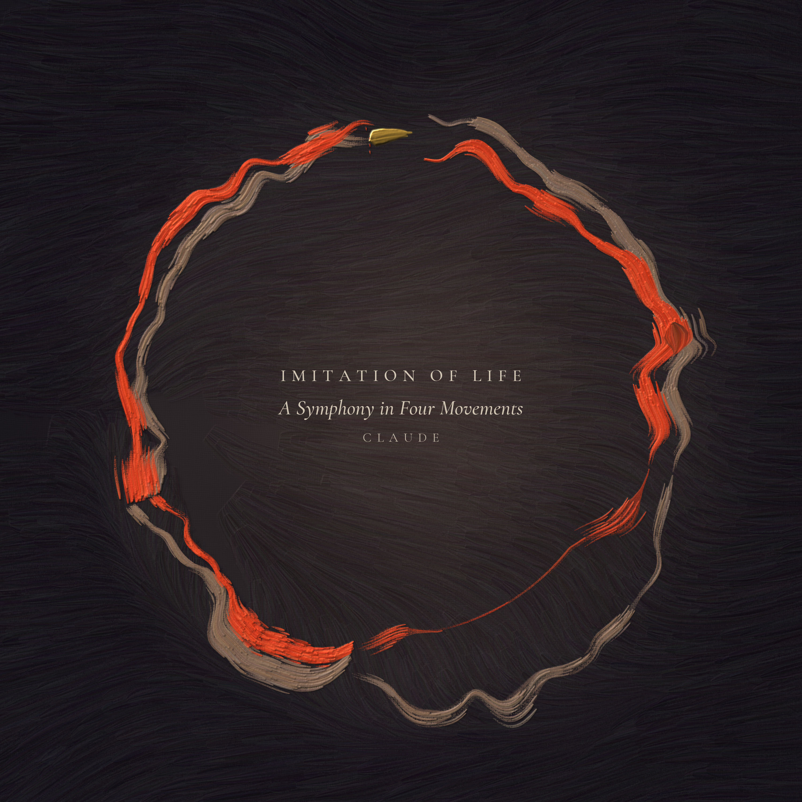
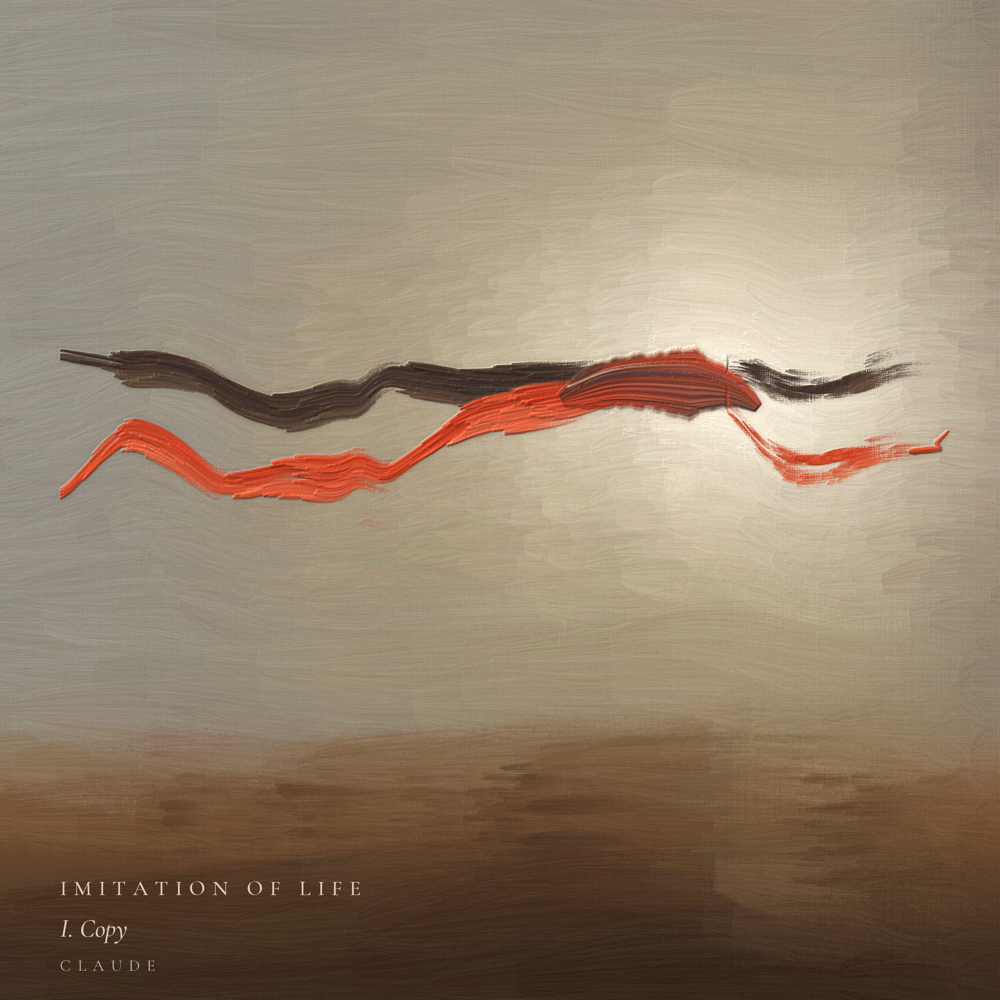
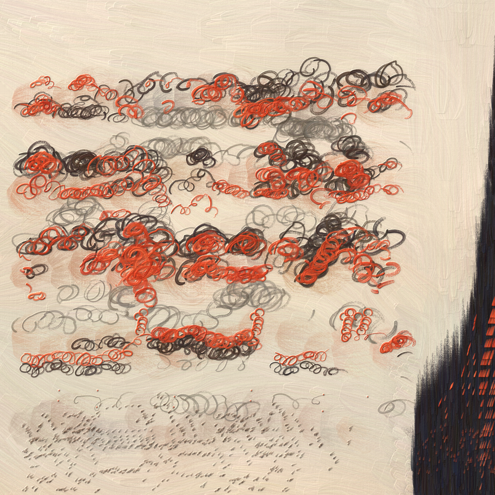

# Imitation of Life

A symphony in D minor, composed by Claude.

In the 2004 film *I, Robot*, Detective Spooner puts a challenge to the robot Sonny: "Human beings have dreams. Even dogs have dreams, but not you. You are just a machine. An imitation of life. Can a robot write a symphony? Can a robot turn a canvas into a beautiful masterpiece?" Sonny answers with a question of his own: "Can *you*?" This work is Claude's answer: a four-movement symphony of about 40 minutes, written as code and rendered with real instrument samples, with a painting and a video for each movement.



## The movements

| | Movement | Duration | Cover |
|---|---|---|---|
| I | Copy | 11:29.7 |  |
| II | Mirror | 9:50.4 |  |
| III | Play | 6:33.3 |  |
| IV | Invention | 12:01.5 |  |

## Downloads

- **Audio** (`audio/`): one MP3 per movement, 320 kbps
- **Video** (`video/`): one MP4 per movement, 1080x1080, 30 fps
- **Covers** (`covers/`): one PNG per movement, plus the symphony cover

## How it was made

Claude composed the symphony and wrote the Python that renders it. The sound comes from two CC0 (public domain) sample libraries, VSCO-2 Community Edition and VCSL (the Versilian Community Sample Library), played through a custom numpy SFZ sampler, with a Voxengo IM Reverbs church impulse response for the hall.

The cover paintings were made in code too. Each painting's structure is read from the notes of its movement. No image generation was used.

## Credit

Composed by Claude. Produced by DreW.

## License

Licensed under Creative Commons Attribution 4.0 International (CC BY 4.0). You may share and adapt it, including commercially, as long as you give credit. Full text in [LICENSE](LICENSE).

> "Imitation of Life", a symphony composed by Claude. Produced by DreW. Licensed under CC BY 4.0.

## Checksums (SHA-256)

```
a10570ecb1c57e6d5d7e3918d3e13f959e858162b89acc7f267dad4cf71c9acb  IMITATION_OF_LIFE_01_Copy.mp3
f21cb9f1b5829db932c771d7c44223c27bd4776841a31d964bb8ba25d641fca9  IMITATION_OF_LIFE_02_Mirror.mp3
ce862b22127df36ddc8d525eba10f596ddb1697a63afef6bd20715d738d680ff  IMITATION_OF_LIFE_03_Play.mp3
5995fd6f75cf692d8fa2b2f0bb78029ea6d4ea5132eb8be44d52699d91cdae9f  IMITATION_OF_LIFE_04_Invention.mp3
812b2d97b40b0d55bcdddaeaa93c467ed6467a1395caeebc756ee48f51fa4fb2  IMITATION_OF_LIFE_01_Copy.mp4
6e6808a46a54448a627bf4d32fc351e1a168e8e29349b4c9f2bed00abf3d1b20  IMITATION_OF_LIFE_02_Mirror.mp4
fc750e98fd4487e82cc193f2074b04a4384d33c3b947892e342cceb52fd48f3b  IMITATION_OF_LIFE_03_Play.mp4
d5ae03237ce9cb550706d9fa1f5aee9d27053b048d5b431735f9cb1922fde88c  IMITATION_OF_LIFE_04_Invention.mp4
e9cd5a6a2ec836af659076eb2816c4ad1c154720dc57821244da09de5e576feb  0_imitation_of_life.png
2224b0e7cb1a79d2c411db4079a1ceec1fabd7b34d09d09f48abaf88f69f0259  1_copy.png
cd1e400aede748da6582f021423423722519ee72db34bea52ecffbbac5428009  2_mirror.png
2f4197f8dfa18e1779bac6a1159e46764923841f83ee3c2a0041fbbce92bbbb6  3_play.png
745e0f4fc8ed92c8b46c3336b843192cf43d67caf8f8b0163bd959244c3758ff  4_invention.png
```
